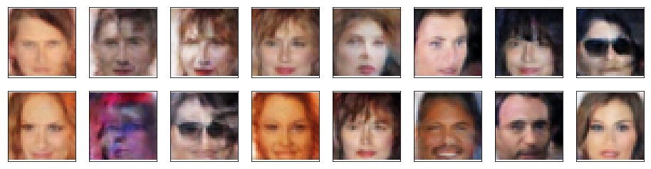

# Generating Faces using GANs

Project 4 of Udacity's DLND: In this project, we use generative adversarial networks to generate new images of faces.

We use, [CelebFaces Attributes Dataset (CelebA)](http://mmlab.ie.cuhk.edu.hk/projects/CelebA.html) to train the adversarial networks.

### Some samples of generated faces:

 

**[NOTE: The above generated images are not very convincing due to their low resolution.]**

_[TODO: Generate higher resolution facial images and improve the results using appropriate measures.]_
